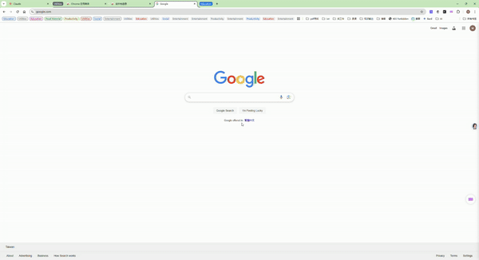
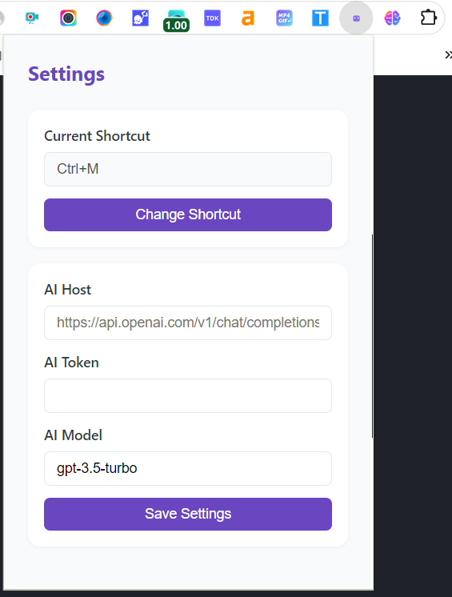

# AIpex: The Ultimate Chrome Extension for Efficient Browsing and AI-Powered Productivity

## Organize Tabs with Ease

⭐ Organize Tabs

AIpex provides powerful tab management features to help you stay organized. Easily switch between open tabs, restore closed tabs, and utilize AI-powered tab organization to keep your workspace tidy.

## Harness the Power of AI with the Chatbot Sidebar

⭐ Chatgpt sidebar

Elevate your browsing experience with the integrated AI chatbot sidebar. Engage in continuous conversations, ask the chatbot to translate text, summarize web pages or videos, and even perform web searches - all without leaving your browser.

## Comprehensive Tab, Bookmark, and History Management

⭐ Tab & BookMark & History Manager

AIpex offers a comprehensive suite of browsing tools, including a tab manager, bookmark manager, and browsing history search. Quickly access, organize, and search your tabs, bookmarks, and browsing history to boost your productivity.

⭐ Google Search Enhancement

[chrome extension](https://chromewebstore.google.com/detail/aipex-%E2%80%94%E2%80%94-tab-history-mana/iglkpadagfelcpmiidndgjgafpdifnke?hl=zh-CN&utm_source=ext_sidebar)

## Key Features

🗄 Tab Management: Switch, open, close, and search your tabs with ease

📚 Bookmark Management: Browse and manage your bookmarks

🔍 Browsing History: Search your browsing history

⚡️ 50+ Productivity Actions: Enhance your workflow with a variety of time-saving actions

🔮 Special Commands: Use commands to filter and perform advanced actions

🧩 Integrations: Seamlessly connect with popular tools like Notion, Figma, and Docs

⌨️ Keyboard Shortcuts: Streamline your browsing with customizable keyboard shortcuts

⚙️ Troubleshooting Tools: Advanced settings to help troubleshoot browsing issues

🌙 Dark Mode: Enjoy a distraction-free dark mode

🤖 AI Chatbot Sidebar: Leverage the power of AI to boost your productivity

## Controlling the interface

### Opening AIpex

To open AIPex, simply press `⌘+M` . You can change the shortcut when clicking the extension.

### Configure AIpex

To use AI features in AIpex, you can click the AIpex in chrome toobar, and then you can customize shorcut or set AI parameters

### Closing AIpex

To close AIPex you can press `Esc`, click on the background, or press the extension icon.

### Switching between dark and light mode

The dark and light theme in AIPex is tied to your system's theme.

On Mac you can change the theme by clicking on the Apple menu (on the top left), opening the System preferences, going into the General section, and then choosing between dark, light, or auto.

After switching the theme you might need to restart your browser.

## List of commands

You can use a variety of commands with AIPex to perform actions or filter your results.

- **/tabs**: Search your tabs
- **/bookmarks**: Search your bookmarks
- **/history**: Search your browser history
- **/ai**: Talk with AI in chatgpt sidebar

## Self-hosting AIPex

You can run AIPex locally without having to install it from the Chrome Store or from Firefox Add-ons.

### Installing on Chrome

1. Download the code. In the web version of GitHub, you can do that by clicking the green "Code" button, and then "Download ZIP".
2. Go to chrome://extensions/ in your browser, and [enable developer mode](https://developer.chrome.com/docs/extensions/mv2/faq/#:~:text=You%20can%20start%20by%20turning,a%20packaged%20extension%2C%20and%20more.).
3. Drag the [src folder] (make sure it's a folder and not a ZIP file, so unzip first), or click on the "Load unpacked" button and locate the folder.
4. That's it, you will now be able to use AIPex locally.

## Work in Progress

- [x] Tab Manager
  - [x] Switch between tabs
  - [x] Use AI to organize tabs
- [x] History Manager
- [x] BookMark Manager
- [ ] Chatgpt sidebar
  - [x] continuos chat
  - [ ] toolbar in page
    - [x] Ask AI
    - [ ] Translate
    - [ ] Summarize Page
    - [ ] Summarize Video
    - [ ] Google
  - [ ] Chatbot
    - [x] Chat
    - [ ] Image
    - [ ] Search

